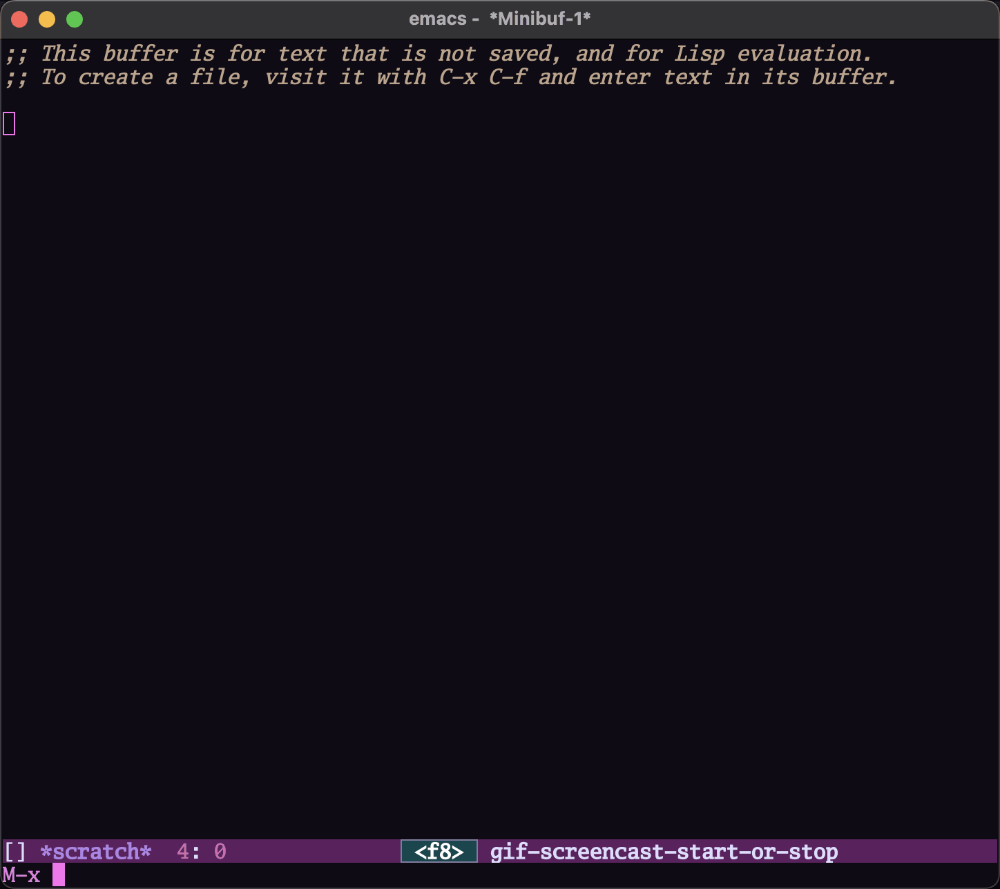
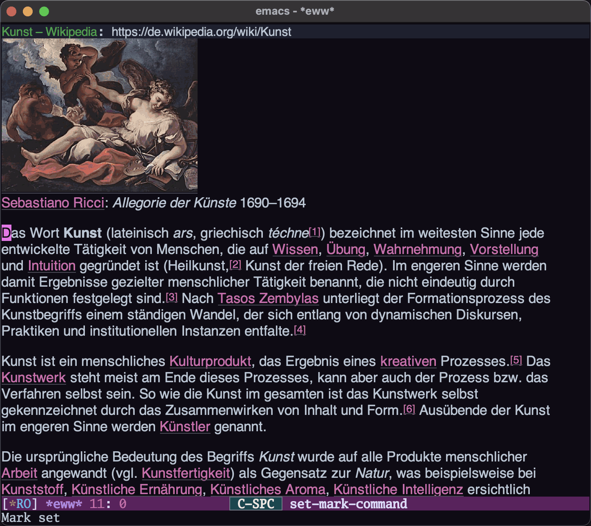
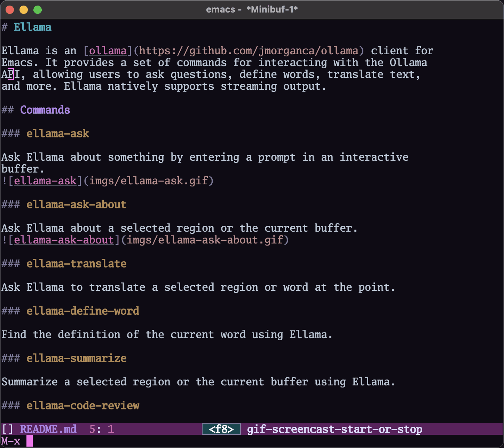
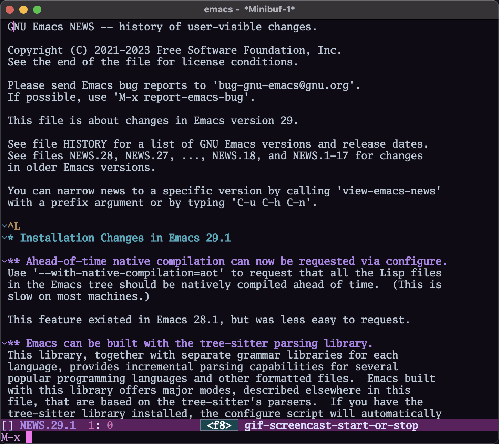
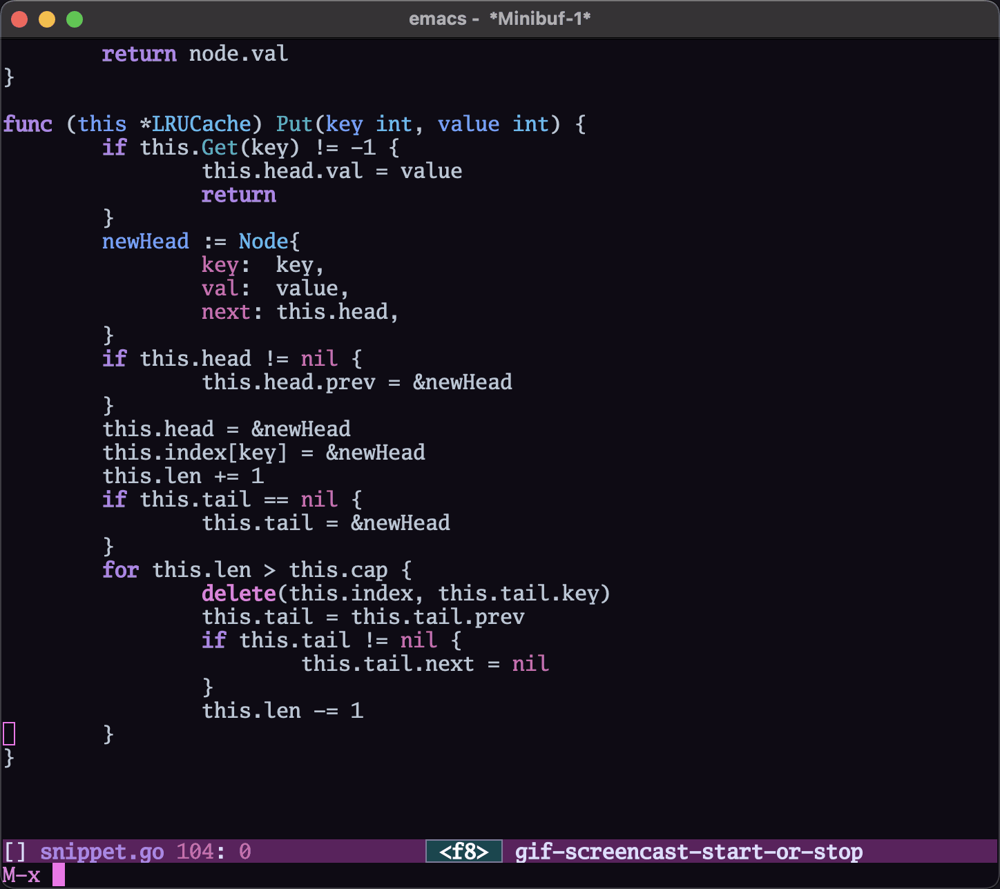
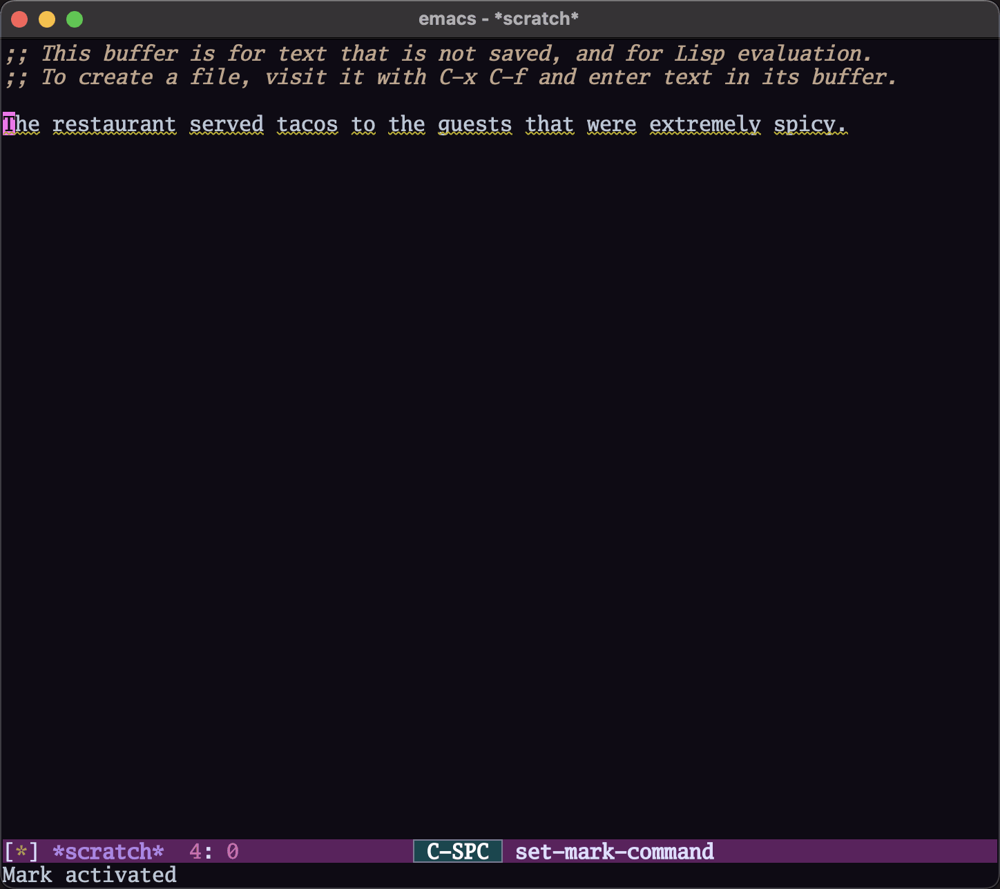

# Ellama

[](http://www.gnu.org/licenses/gpl-3.0.txt)
[](https://melpa.org/#/ellama)
[](https://stable.melpa.org/#/ellama)

Ellama is a tool for interacting with large language models from
Emacs. It allows you to ask questions and receive responses from the
LLMs. Ellama can perform various tasks such as translation, code
review, summarization, enhancing grammar/spelling or wording and
more through the Emacs interface. Ellama natively supports streaming
output, making it effortless to use with your preferred text editor.

## What's new

- `10.12.2023` - Added command `ellama-complete`.
- `17.11.2023` - Changes by ellama is now atomic. It can be useful if
  you want to undo this changes. Two new commands added:
  `ellama-ask-selection` and `ellama-ask-line`. Some cosmetic changes
  done.
- `28.10.2023` - Switched from
  [ollama](https://github.com/jmorganca/ollama)'s API to
  [llm library](https://elpa.gnu.org/packages/llm.html).
  [Many providers](https://github.com/ahyatt/llm#setting-up-providers)
  supported.

## Installation

Install the package `ellama` from
[MELPA](https://melpa.org/#/getting-started). Just `M-x`
`package-install`<kbd>Enter</kbd> `ellama` <kbd>Enter</kbd>.
By default it uses [ollama](https://github.com/jmorganca/ollama)
provider and [zephyr](https://ollama.ai/library/zephyr) model. If you
ok with it, you need to install
[ollama](https://github.com/jmorganca/ollama) and pull
[zephyr](https://ollama.ai/library/zephyr). You can use `ellama` with
other model or other llm provider. In that case you should customize
ellama configuration like this:

``` emacs-lisp
(use-package ellama
  :init
  (setopt ellama-language "German")
  (require 'llm-ollama)
  (setopt ellama-provider
		  (make-llm-ollama
		   :chat-model "zephyr:7b-beta-q6_K" :embedding-model "zephyr:7b-beta-q6_K"))
  ;; Predefined llm providers for interactive switching.
  ;; You shouldn't add ollama providers here - it can be selected interactively
  ;; without it. It is just example.
  (setopt ellama-providers
		  '(("zephyr" . (make-llm-ollama
						 :chat-model "zephyr:7b-beta-q6_K"
						 :embedding-model "zephyr:7b-beta-q6_K"))
			("mistral" . (make-llm-ollama
						  :chat-model "mistral:7b-instruct-v0.2-q6_K"
						  :embedding-model "mistral:7b-instruct-v0.2-q6_K"))
			("mixtral" . (make-llm-ollama
						  :chat-model "mixtral:8x7b-instruct-v0.1-q3_K_M-4k"
						  :embedding-model "mixtral:8x7b-instruct-v0.1-q3_K_M-4k")))))
```

## Commands

### ellama-chat

Ask Ellama about something by entering a prompt in an interactive
buffer and continue conversation.

### ellama-ask

Alias for `ellama-chat`.


### ellama-ask-about

Ask Ellama about a selected region or the current buffer.


### ellama-ask-selection

Send selected region or current buffer to ellama chat.

### ellama-ask-line

Send current line to ellama chat.

### ellama-complete

Complete text in current buffer with ellama.

### ellama-translate

Ask Ellama to translate a selected region or word at the point.


### ellama-define-word

Find the definition of the current word using Ellama.


### ellama-summarize

Summarize a selected region or the current buffer using Ellama.


### ellama-code-review

Review code in a selected region or the current buffer using Ellama.


### ellama-change

Change text in a selected region or the current buffer according to a
provided change.

### ellama-enhance-grammar-spelling

Enhance the grammar and spelling in the currently selected region or
buffer using Ellama.


### ellama-enhance-wording

Enhance the wording in the currently selected region or buffer using Ellama.

### ellama-make-concise

Make the text of the currently selected region or buffer concise and
simple using Ellama.

### ellama-change-code

Change selected code or code in the current buffer according to a
provided change using Ellama.

### ellama-enhance-code

Change selected code or code in the current buffer according to a
provided change using Ellama.

### ellama-complete-code

Complete selected code or code in the current buffer according to a
provided change using Ellama.

### ellama-add-code

Add new code according to a description, generating it with a provided
context from the selected region or the current buffer using Ellama.

### ellama-render

Render the currently selected text or the text in the current buffer
as a specified format using Ellama.

### ellama-make-list

Create a markdown list from the active region or the current buffer using Ellama.

### ellama-make-table

Create a markdown table from the active region or the current buffer using Ellama.

### ellama-summarize-webpage

Summarize a webpage fetched from a URL using Ellama.

### ellama-provider-select

Select ellama provider.

### ellama-code-complete

Alias to the `ellama-complete-code` function.

### ellama-code-add

Alias to the `ellama-add-code` function.

### ellama-code-edit

Alias to the `ellama-change-code` function.

### ellama-code-improve

Alias to the `ellama-enhance-code` function.

### ellama-improve-wording

Alias to the `ellama-enhance-wording` function.

### ellama-improve-grammar

Alias to the `ellama-enhance-grammar-spelling` function.

### ellama-improve-conciseness

Alias to the `ellama-make-concise` function.

### ellama-make-format

Alias to the `ellama-render` function.

### ellama-ask-interactive
Alias to the `ellama-ask` function.

## Keymap

Here is a table of keybindings and their associated functions in
Ellama, using the `C-x e` prefix:

| Keymap | Function                   | Description                        |
|--------|----------------------------|------------------------------------|
| "c c"  | ellama-code-complete       | Code complete                      |
| "c a"  | ellama-code-add            | Code add                           |
| "c e"  | ellama-code-edit           | Code edit                          |
| "c i"  | ellama-code-improve        | Code improve                       |
| "c r"  | ellama-code-review         | Code review                        |
| "s s"  | ellama-summarize           | Summarize                          |
| "s w"  | ellama-summarize-webpage   | Summarize webpage                  |
| "i w"  | ellama-improve-wording     | Improve wording                    |
| "i g"  | ellama-improve-grammar     | Improve grammar and spelling       |
| "i c"  | ellama-improve-conciseness | Improve conciseness                |
| "m l"  | ellama-make-list           | Make list                          |
| "m t"  | ellama-make-table          | Make table                         |
| "m f"  | ellama-make-format         | Make format                        |
| "a a"  | ellama-ask-about           | Ask about                          |
| "a i"  | ellama-ask-interactive     | Chat with ellama (Interactive)     |
| "a l"  | ellama-ask-line            | Ask about current line             |
| "a s"  | ellama-ask-selection       | Ask about selection                |
| "t t"  | ellama-translate           | Text translate                     |
| "t c"  | ellama-complete            | Text complete                      |
| "d w"  | ellama-define-word         | Define word                        |
| "p s"  | ellama-provider-select     | Provider select                    |

## Configuration

The following variables can be customized for the Ellama client:

- `ellama-buffer`: The default Ellama buffer name.
- `ellama-enable-keymap`: Enable the Ellama keymap.
- `ellama-keymap-prefix`: The keymap prefix for Ellama.
- `ellama-user-nick`: The user nick in logs.
- `ellama-assistant-nick`: The assistant nick in logs.
- `ellama-buffer-mode`: The major mode for the Ellama logs buffer.
Default mode is `markdown-mode`.
- `ellama-language`: The language for Ollama translation. Default
language is english.
- `ellama-provider`: llm provider for ellama. Default provider is
`ollama` with [zephyr](https://ollama.ai/library/zephyr) model.
There are many supported providers: `ollama`, `open ai`, `vertex`,
`GPT4All`. For more information see [llm
documentation](https://elpa.gnu.org/packages/llm.html)
- `ellama-providers`: association list of model llm providers with
  name as key.
- `ellama-spinner-type`: Spinner type for ellama. Default type is
`progress-bar`.
- `ellama-ollama-binary`: Path to ollama binary.

## Acknowledgments

Thanks [Jeffrey Morgan](https://github.com/jmorganca) for excellent
project [ollama](https://github.com/jmorganca/ollama). This project
cannot exist without it.

Thanks [zweifisch](https://github.com/zweifisch) - I got some ideas
from [ollama.el](https://github.com/zweifisch/ollama) what ollama
client in Emacs can do.

Thanks [Dr. David A. Kunz](https://github.com/David-Kunz) - I got more
ideas from [gen.nvim](https://github.com/David-Kunz/gen.nvim).

Thanks [Andrew Hyatt](https://github.com/ahyatt) for `llm` library.
Without it only `ollama` would be supported.

# Contributions

If you are interested in creating a provider, please send a pull
request, or open a bug. This library is part of GNU ELPA, so any major
provider that we include in this module needs to be written by someone
with FSF papers. However, you can always write a module and put it on
a different package archive, such as MELPA.
